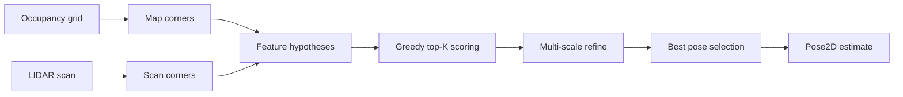

# autolocalize

Fast **initial robot localization** on ROS-style occupancy grids: estimate the LIDAR-to-map transform from a single scan using wall-corner features, vectorized scan matching, and optional coarse grid fallback.

Designed for maze-like indoor maps where combinatorial feature pairing would be too slow, but geometric consistency still matters.

## Features

- Load standard **YAML + PGM** occupancy grids (`map_server` format)
- **2D LIDAR simulator** (ray cast against the grid)
- **Corner features** from map boundaries and scan endpoints
- **Greedy hypothesis search** with top-K refinement (not full combinatorial enumeration)
- **Connected free-space checks** so impossible poses are rejected
- **~100% pose recovery** on 1000 random free-space poses in the bundled maze map (see tests)
- Optional **matplotlib** visualization script

## Requirements

- Python **3.12+**
- [uv](https://docs.astral.sh/uv/) (recommended) or pip

## Install

```bash
git clone https://github.com/ryanrudes/autolocalize.git
cd autolocalize
uv sync
```

Optional visualization dependencies:

```bash
uv sync --extra viz
```

## Quick start

Demo localization at the origin of the sample maze:

```bash
uv run python -m autolocalize
# or
uv run python main.py
```

Programmatic usage:

```python
from autolocalize import (
    InitialLocalizer,
    InitialLocalizerConfig,
    LidarConfig,
    LidarSimulator,
    Pose2D,
    load_map,
)

grid = load_map("maps/churchsidemaze1.yaml")
sim = LidarSimulator(grid, LidarConfig(num_rays=360))
scan = sim.scan(Pose2D(0.0, 0.0, 0.0))

localizer = InitialLocalizer(grid, InitialLocalizerConfig())
result = localizer.localize(scan, lidar_config=sim.config)

if result.success:
    print(result.pose, result.score)
```

## Visualization

Random poses, simulated scans, and estimated vs. true pose:

```bash
uv sync --extra viz
uv run python scripts/visualize_localization.py --count 10 --seed 42
```

## How it works



1. **Precompute** salient wall corners on the map (once per map).
2. **Extract** corners from the scan (sharp range discontinuities).
3. **Generate poses** from corner correspondences (singles and length-matched pairs).
4. **Score** hypotheses by occupancy hit rate (fast numpy raster lookup).
5. **Refine** the top candidates with a coarse-to-fine local search.
6. **Fall back** to a coarse position/heading grid when endpoint match stays weak.

Symmetric environments (e.g. a plain box room) can remain ambiguous; use distinctive maps or tighten config for those cases.

## Configuration

`InitialLocalizerConfig` controls matching thresholds, ray subsampling during search vs. final scoring, top-K refinement, free-space consistency, and grid fallback. See `autolocalize/localization/initial.py` for defaults.

## Maps

Maps live under [`maps/`](maps/) as paired `.yaml` + `.pgm` files. The included `churchsidemaze1` map is used in tests and demos.

## Tests

Fast unit tests (default):

```bash
uv run pytest tests/ -m "not slow and not stress"
```

Full maze Monte Carlo (slow):

```bash
uv run pytest tests/ -m slow
uv run pytest tests/ -m stress   # 1000 random poses, ≥99% success
```

## Project layout

| Path | Purpose |
|------|---------|
| `autolocalize/` | Library: map, sensors, features, localization |
| `maps/` | Sample occupancy grid |
| `tests/` | Pytest suite + LIDAR simulator regression |
| `scripts/visualize_localization.py` | Debug / demo plots |
| `main.py` | Thin CLI wrapper around `python -m autolocalize` |

## License

MIT — see [LICENSE](LICENSE).
